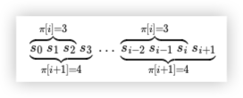

# Prefix Function: $\pi[i]$

给定一个字符串`s`的前缀函数$\pi_s(i)$定义为：子串`s[0: i]`的相等的真前缀与真后缀的最长长度

Ex, `s` = abcadabc

0 0 0 1 0 1 2 3

$\pi_s[0] = 0$, 规定$\pi[0] = 0$

$\pi_s[1] = 0$, `ab`没有相等的真前缀和真后缀

$\pi_s[2] = 0$, `abc`没有相等的真前缀和真后缀

$\pi_s[3] = 1$, `abca`有相等的真前缀和真后缀`a`

$\pi_s[4] = 0$, `abcad`没有相等的真前缀和真后缀

$\pi_s[5] = 1$, `abcada`有相等的真前缀和真后缀`a`

$\pi_s[6] = 2$, `abcadab`有相等的真前缀和真后缀`ab`

$\pi_s[7] = 3$, `abcadabc`有相等的真前缀和真后缀`abc`

TODO: Brute force

Overservation 1:

$\pi[i]$和$\pi[i+1]$的差值最少为1，即$\pi[i+1] \leq \pi[i] +1$

Reference: [oi-wiki-prefix-function][1]

[1]: https://oi-wiki.org/string/kmp/