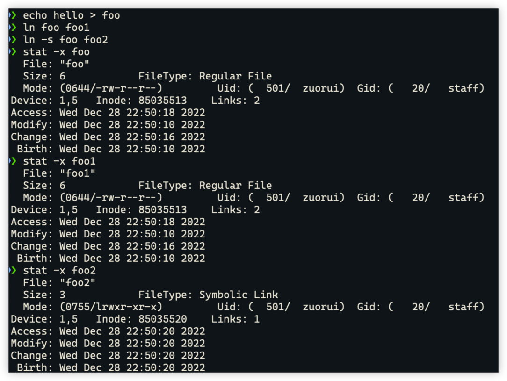
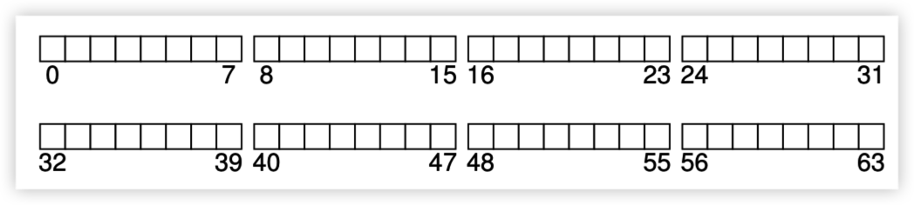
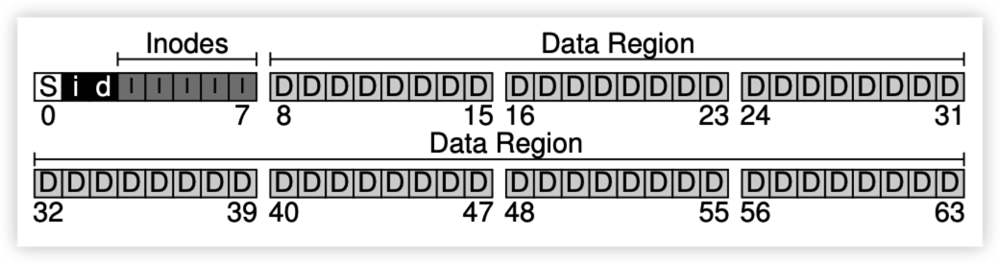
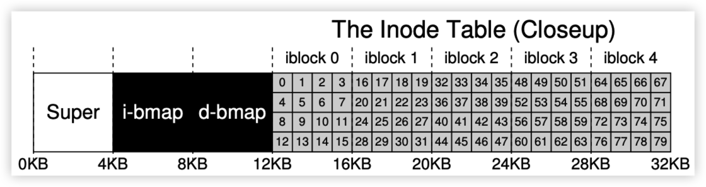
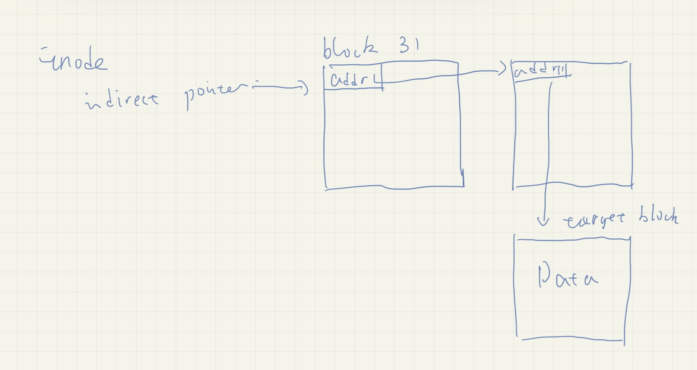
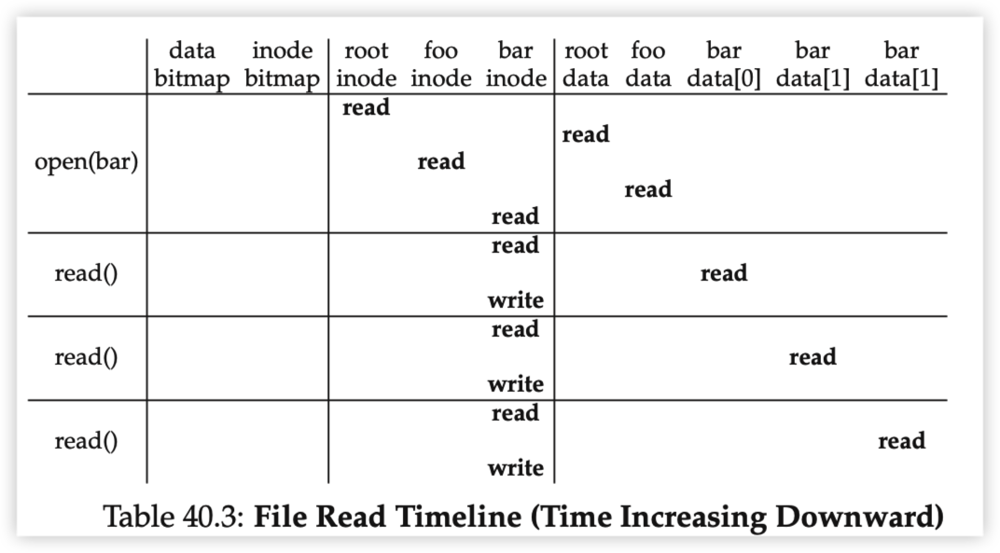
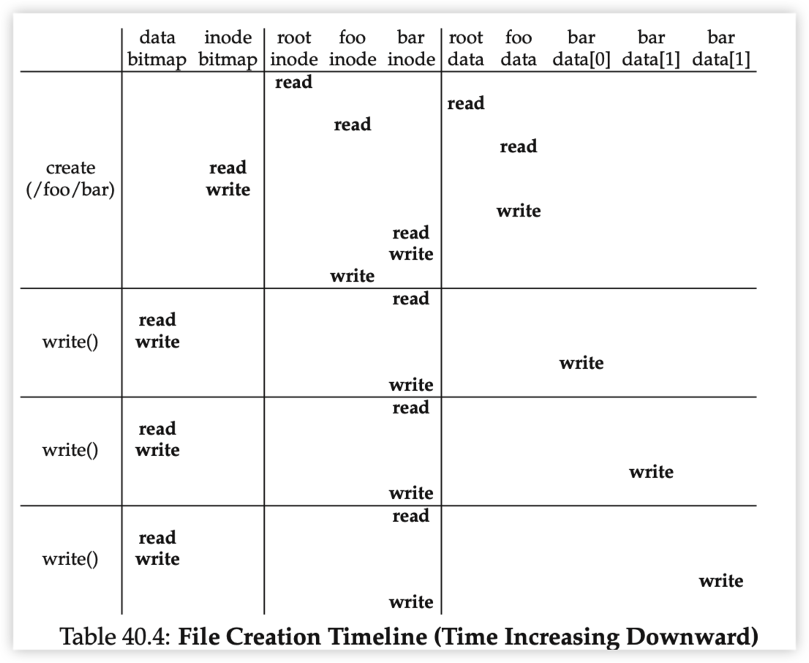

Directory just store (filename, inode) pair in it.

Hard link is just create another (filename, inode) pair under the directory.

Soft link is the third file type beyond file and dir whose content is the linked-to filename, thus soft link has different inode number.

See,

## Inode

Given a free disk space, how to design file system on that?

1. Sperate this space into **file system blocks**

2. Assign data region, inode table, bit map for data region and inode table and super block

Data region: User file content

Inode table: inode information, like block number, file creation date, etc.

Bitmap: Record if the block is allocated.

Super block: Store information about this file system

How to access file (foo, 17)?

- inode = 17, inode address = inode_start_address + 17 * sizeof(inode) = 17 *256B = 4352B; Translate this byte address into sector address by 4352B / 512B = 8.5; Read from disk to fetch inode 17
- Got disk pointer inside inode 17 and Read again from disk to get file content

This method is called **Direct disk pointer**

Drawbacks for this: when file grows larger than (12 disk pointer * 4KB block size), it will overflow.

Solutions: Multi-Level Index:

Basic idea: 

- allocate a block in data region then make inode holds an indirect pointer to that block
- Inside the block, stores the disk address

Then file becomes extendable.

For example, two-indirect pointer works like this:

### Free space management

when new files being created, file system needs go through inode bitmap to find a free inode number to that file and also go through the data bitmap to find the blocks to allocate for this file.

