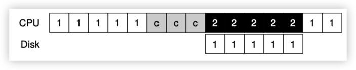
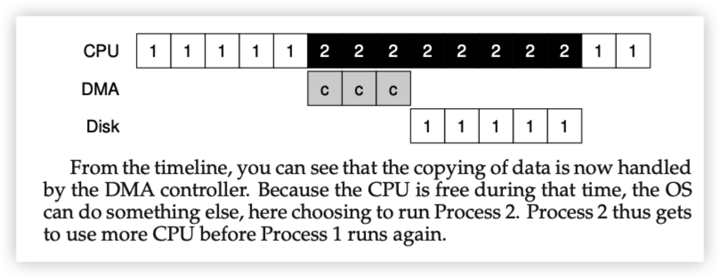
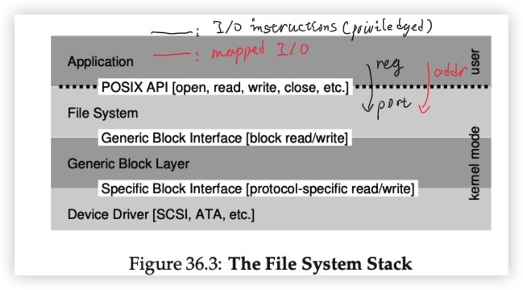
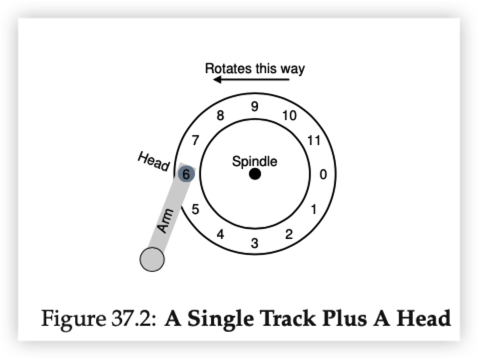
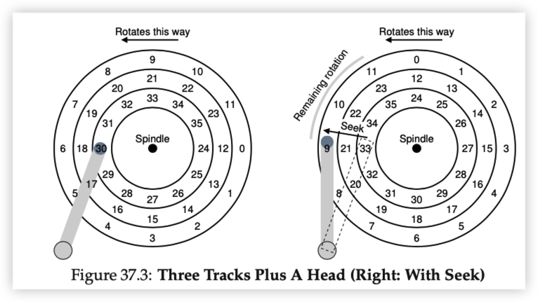
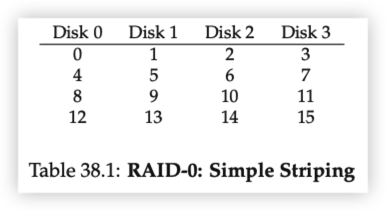
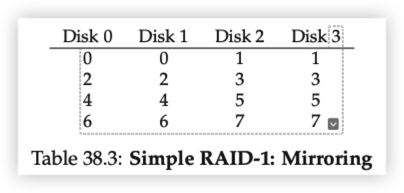
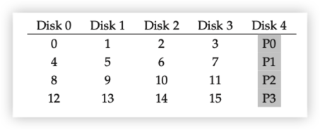
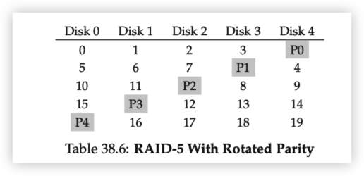

CPU 和 I/O 设备交互的方式有：polling, Interrupt

快的设备用：polling

慢的设备用：Interrupt

>  Thus, if a device is fast, it may be best to poll; if it is slow, interrupts, which allow overlap, are best. If the speed of the device is not known, or sometimes fast and sometimes slow, it may be best to use a **hybrid** that polls for a little while and then, if the device is not yet finished, uses interrupts. This **two-phased** approach may achieve the best of both worlds.

DMA (Direct Memory Access)

怎么去除 `c`: CPU copy data from memory to device

Ans: Use an DMA Engine to do this tedius job

# Hard Disk Drive

$$
T_{I/O} = T_{seek} + T_{rotation}+T_{transfer}
$$

## RAID

RAID Level 0: 没有备份

:white_check_mark: Performance

:white_check_mark: Capacity

:negative_squared_cross_mark: Reliability

RAID 1: Mirroring

每块盘增加一块备份盘

RAID 4: Parity 增加奇偶校验盘

问题：比如同时修改`block 4` 和`block 13`时，需要更新`P1`和`P3`

，但是`P1`和`P3`在同一盘上，不能sitmultaneously地进行

RAID 5: Rotating Parity
