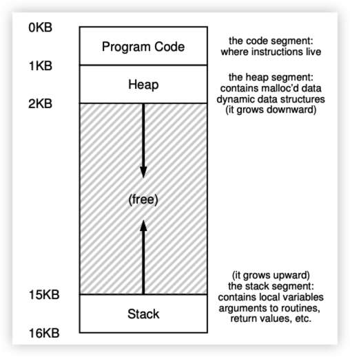
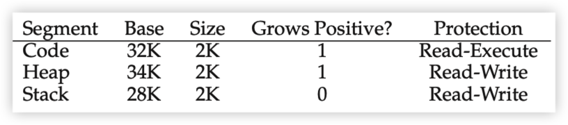
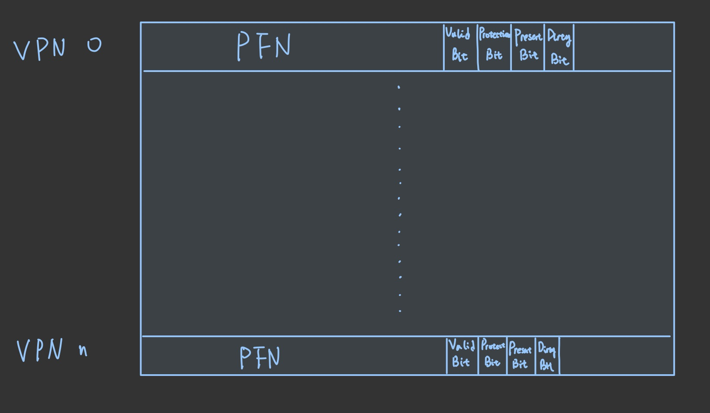
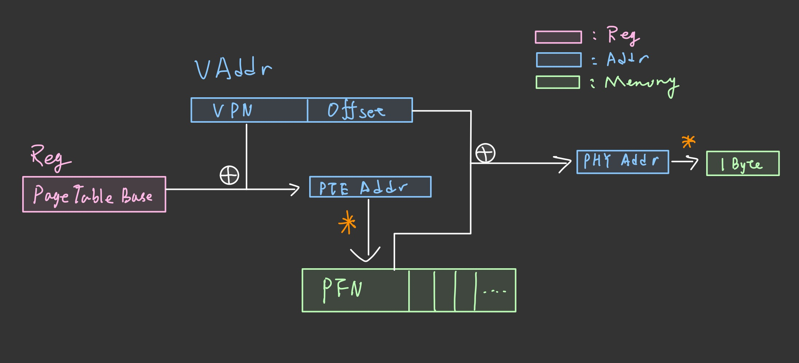
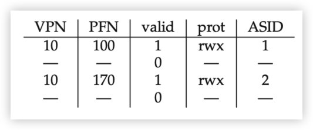
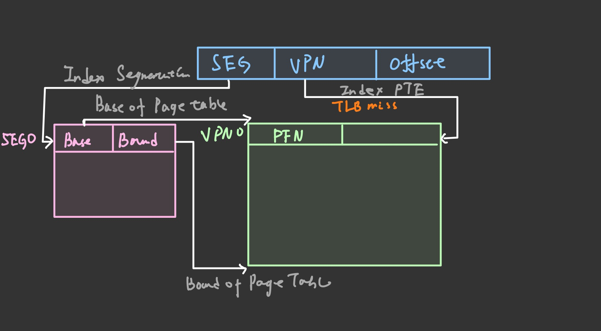
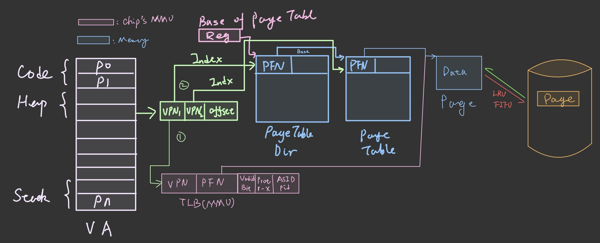

Hardware use base/bound reg to do address translation:

if offset < bound:

Phy Addr = base + offset

## Segmentation

Each logic segmentation (code, stack and heap) assign a pair of base/bound reg to it and complemented with growing direction and permission:

### Paging

Page table

Valid bit: whether this translation is valid or not. For example for unallocated page is not valid translation

Protection bit: whether the process has the priviledge to access this page

Present bit: whether this page is in memory or disk

Dirty bit: whether this page has ever been modified since last swapped into memory

## TLB

Use ASID to distinguish different process

### Segmentaion + Paging

