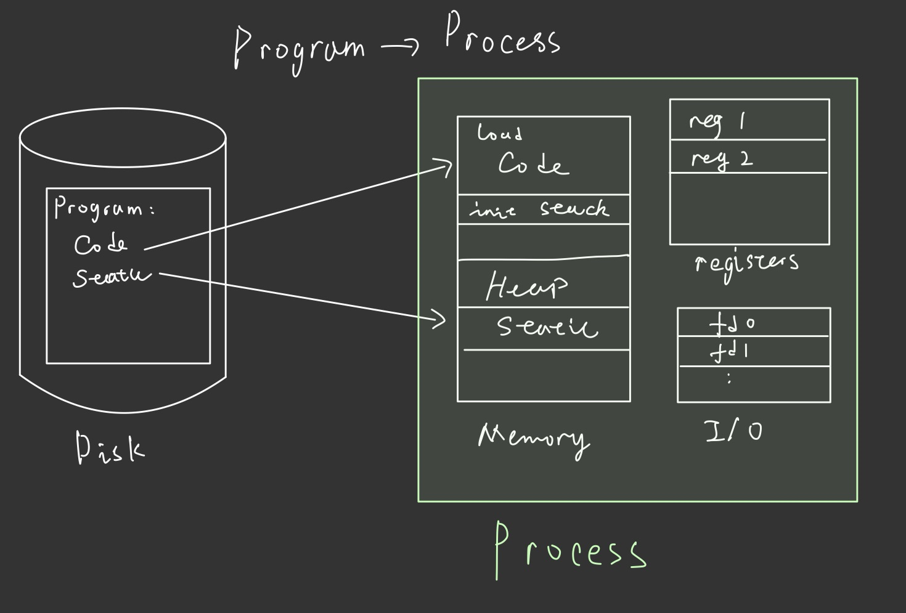
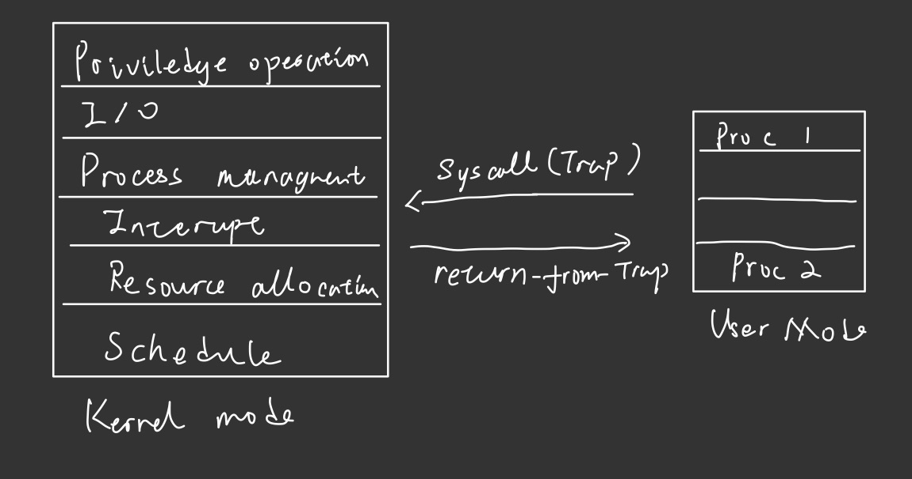
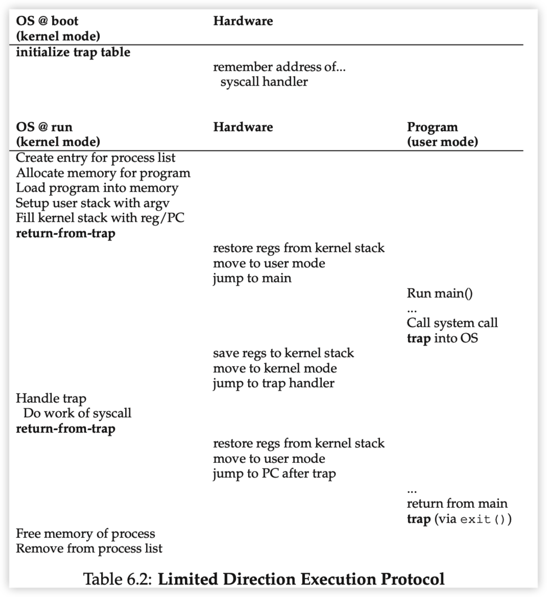
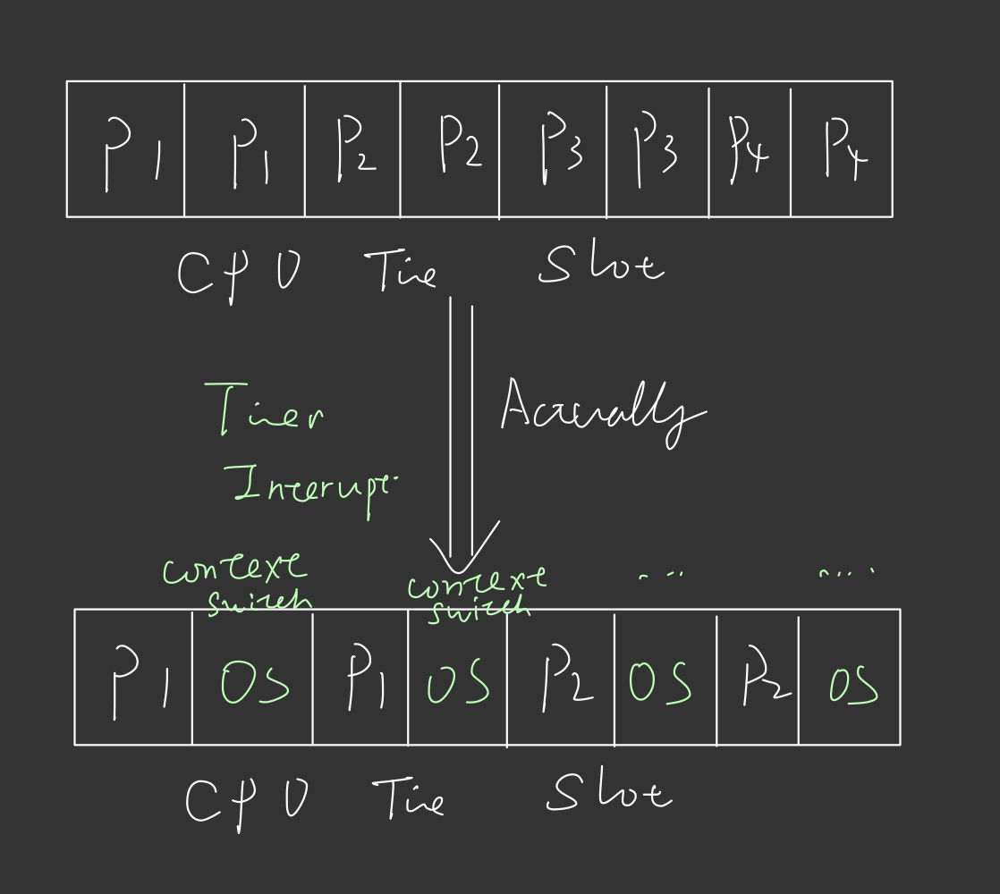
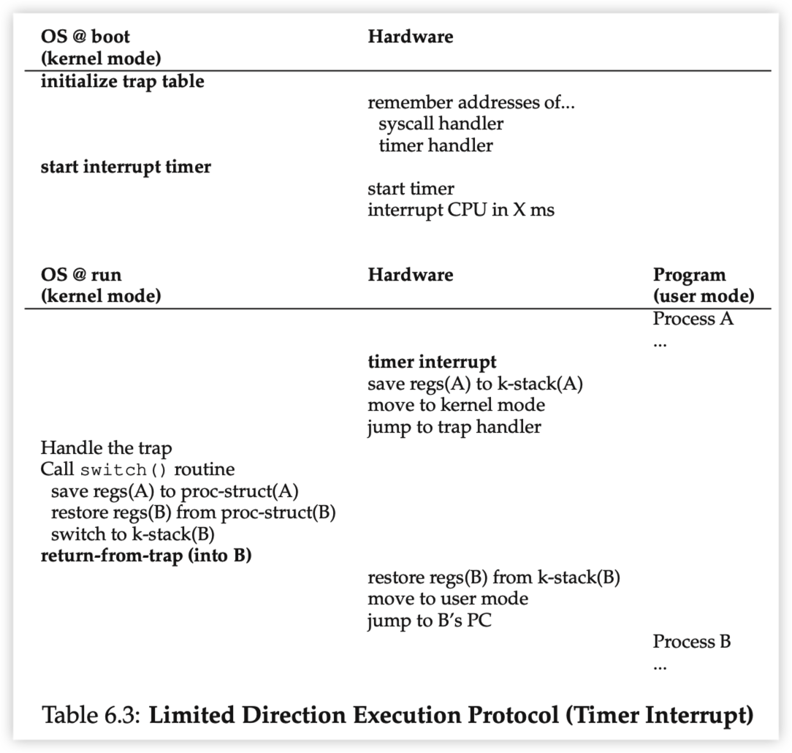
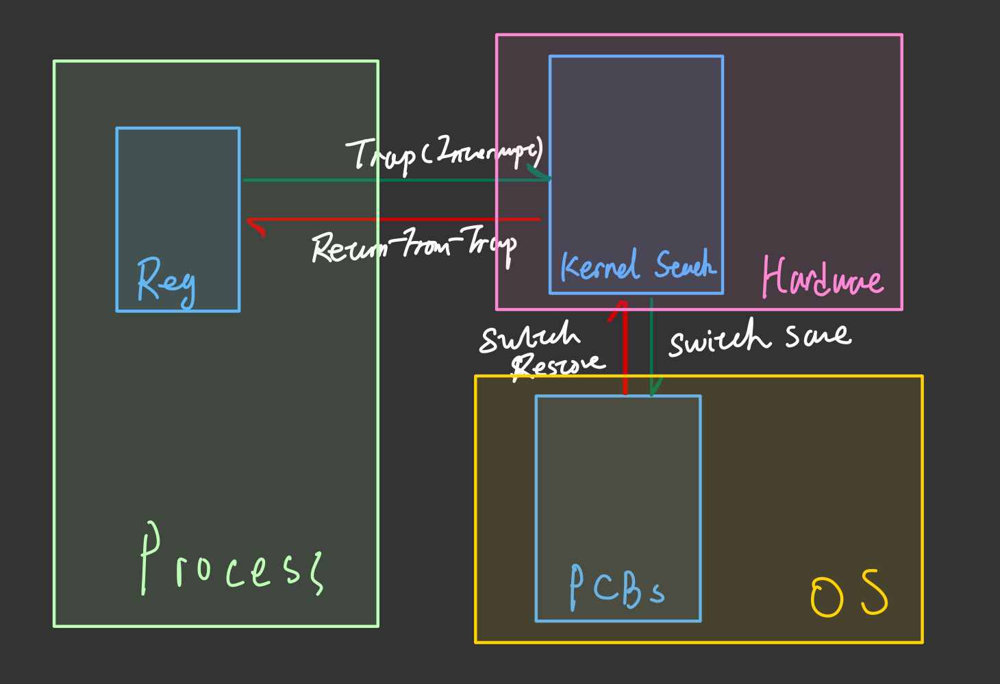
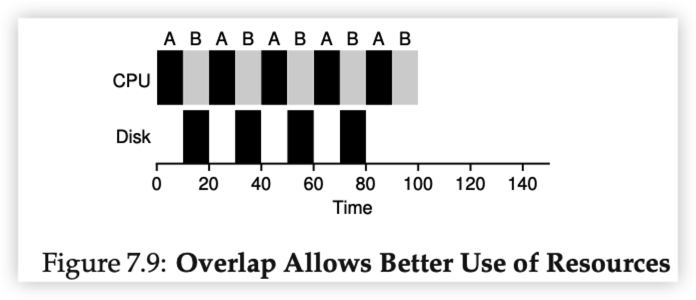
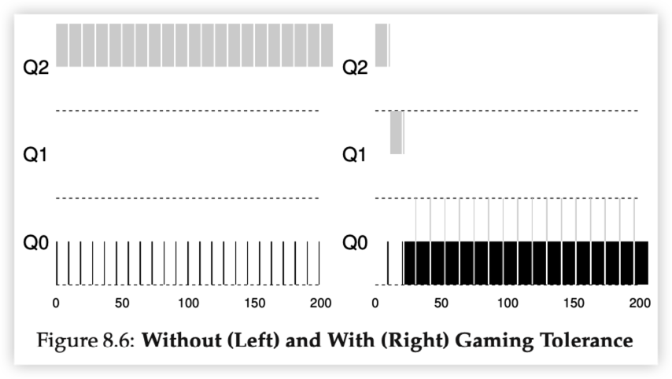
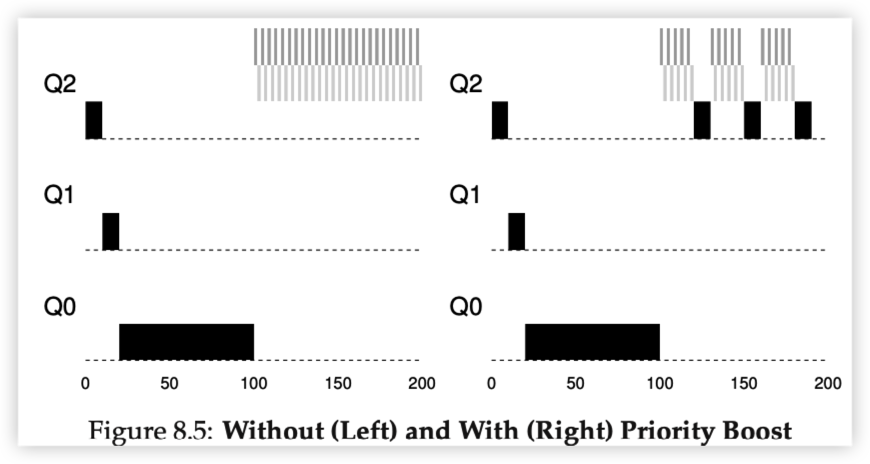

`fork()` 创建一个和父进程一样的子进程，然后在子进程中return 0

父进程中return子进程的pid

`exec()`覆写当前进程的代码段，堆栈等，成功的call to `exec`从不返回

### Syscall and Trap

How OS keep control of hardware and resources?

At Boot time, kernel intialize trap table for CPU.

Trap: User mode -> Kernel Mode

- Save Reg to kernel stack (hardware)
- move to kernel mode
- jump to trap handler

Return-from-trap: Kernel mode -> User mode

- Restore Reg from kernel stack (hardware)
- move to user mode
- jump to process next instruction

### Context Switch

Save context: Regs, PC, Kernel stack pointers.

Since Interrupt is handled by hardware, which means OS did not have control at that time, trap/return-from-trap handler will need **kernel stack** to stores those information so when OS take control, it would be able to get regs value.

## Scheduling

$T_{turnaround} = T_{complete} - T_{arrival}$

$T_{response} = T_{first run} - T_{arrival}$

### FIFO

### SJF (Short Job First)

在同时到达的process中选择最短的

### STCF (Shortest Time-to-Completion First)

抢占式的SJF

Good for **Turnaround time**

Bad for **Response Time**

## RR(Round Robin)

Good for **Response Time**

Bad for **Turnaround Time**

### I/O 

## MLFQ(Multi-Level Feedback Queue)

- **Rule 1**: if $Priority(A) > Priority(B)$, A runs B doesn't

- **Rule 2**: if $Priority(A) = Priority(B)$, A and B run in RR

- **Rule 3**: When a job enters the system, it is placed at the highest priority

- **Rule 4a**: If a job uses up its time allotment at a given level, its priority is reduced

  Here allotment meas: Each level of queue has unique length of time slice

  

- **Rule 5**: After some time period S, move all jobs in the system to the topmost queue

