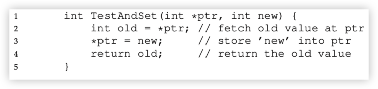
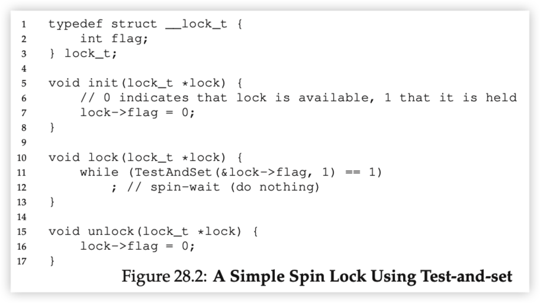

# Locks

Hardware primitives:

1. Test-and-set

Pseudo C code:

With the help of atomic *test-and-set* from hardware, simplest lock implementation would be **spin-lock**

Cons: not working on single CPU, since thread will spin on the while loop and thus owner of the lock get no chance to release this lock.

