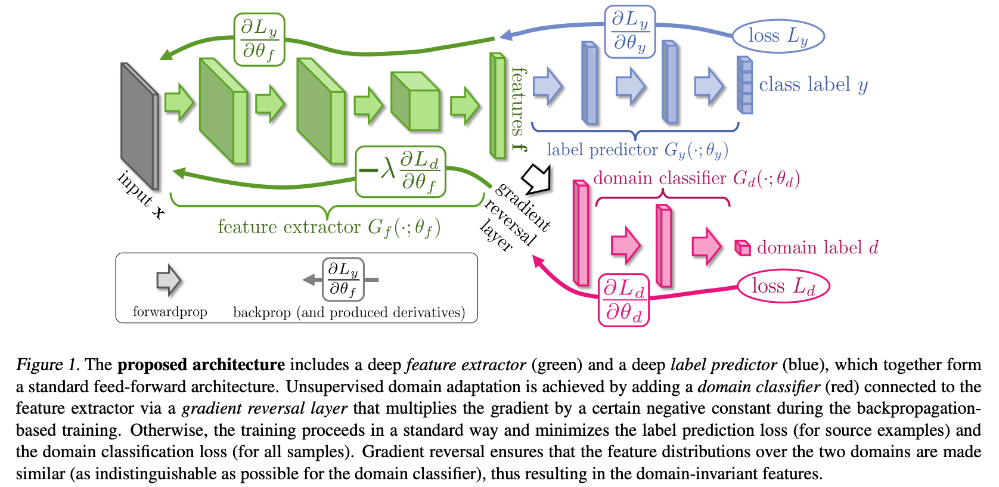

# Unsupervised Domain Adaptation by Backpropagation

> Ganin, Yaroslav, and Victor Lempitsky. “Unsupervised Domain Adaptation by Backpropagation.” arXiv, February 27, 2015. https://doi.org/10.48550/arXiv.1409.7495.

Using $G_d$ as dissimilarity measurement of the distribution of target domain $T(\bold{f}) = \{G_f(\bold{x};\theta_f)|x\sim T(\bold{x})\}$ and source domain $S(\bold{f}) = \{G_f(\bold{x};\theta_f)|x\sim S(\bold{x})\}$, why this works?

| input                                                  | domain | feature | $G_d$'s output        | label for $G_d$       |
| ------------------------------------------------------ | ------ | ------- | --------------------- | --------------------- |
| t                                                      | T      | $f_t$   | 0                     | 1                     |
| one data sampe from training dataset  of target domain |        |         | 0 means source domain | 1 means target domain |

Measure the dissimilarity of the two distribution is non-trivial due to high dimension and distribution continuous changing during training, so we can use $G_d$ to measure this dissimilarity, higher the $L_d$ means feature $f$ are more unlike the label, which means the dissimilarity.

Assume $G_d$ is trained to be optimal, the $f_t$ is "GOOD" for $G_f$ if $G_d(f_t)$ is wrongly prediction results equals to 0 but should be 1. Because of this, $G_f$ should maximize the loss $L_d$

