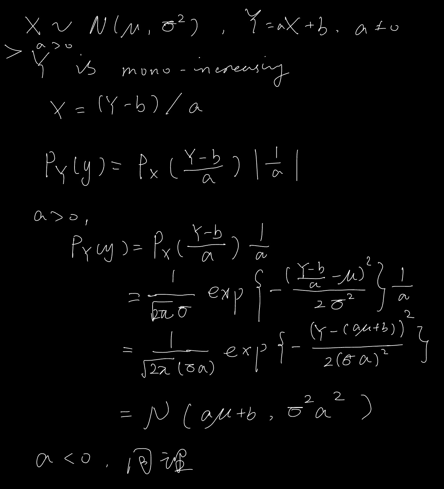

## Function of one r.v. 

$Y = g(X)$

1. X 是离散，Y也是离散
2. X是连续，Y是离散

将Y的取值一一列出，再将Y的各种取值的概率求出

3. X是连续，Y是连续

   1. $g(x)$是严格单调函数

   反函数$g^{-1}(y) = h(y)$有连续导函数，则$Y=g(X)$的PDF为
   $$
   \begin{equation}
   	p_{Y}(y) =
   		\begin{cases}
   			p_{X}[h(y)]|h^\prime(y)|, &a<y<b \newline
   			0, &\text{其他}
   		\end{cases}
   \end{equation}
   $$
   例1: $X \sim \mathcal{N}(\mu, \sigma^2)$, 则当$a\neq0$时，有$Y =aX+b$, 求$Y$的PDF
   
   
   
   **结论1**：$X\sim \mathcal{N}(\mu, \sigma^2)$ $Y = aX+b \sim \mathcal{N}(a\mu+b, a^2\sigma^2)$
   
   2. 否则从$F_Y(y) = P(g(X) \leq y)$先求CDF再找PDF

## Function of multiple r.v.

### X+Y

X, Y 独立

$p_Z(z) = \int_{-\infty}^{\infty}p_X(z-y)p_Y(y)dy=\int_{-\infty}^{\infty}p_X(x)p_Y(z-x)dx$

