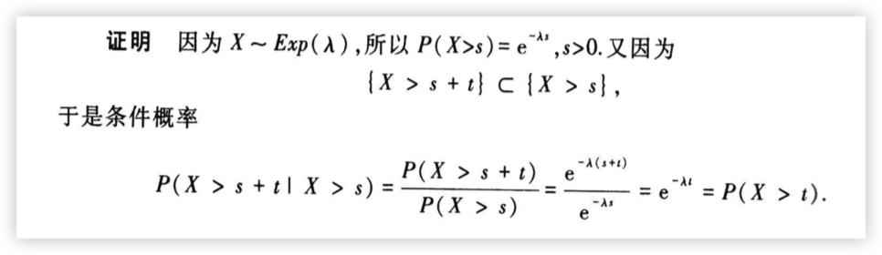
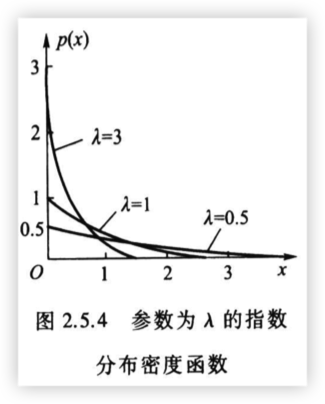

# 正态（高斯）分布

$$
X \sim \mathcal{N}(\mu,\,\sigma^{2})
$$

$$
p(x) = \frac{1}{\sqrt{2\pi}\sigma}e^{-\frac{(x-\mu)^2}{2\sigma^2}}, -\infty < x < \infty
$$

$$
F(x) = \frac{1}{\sqrt{2\pi}\sigma}\int_{-\infty}^{x}e^{-\frac{(t-\mu)^2}{2\sigma^2}}dt
$$

如果RV $X \sim \mathcal{N}(\mu,\,\sigma^{2})$, 则可以化为标准正态分布$U = \frac{X-\mu}{\sigma} \sim \mathcal{N}(0, 1)$

$E[X] = \mu$

$Var[X] = \sigma^2$

- 若$X\sim \mathcal{N}(\mu, \sigma^2)$, $Y=aX+b \sim \mathcal{N}(a\mu+b, a^2\sigma^2)$

- 若$X\sim \mathcal{N}(\mu_1, \sigma_1^2)$, $Y\sim \mathcal{N}(\mu_2, \sigma_2^2)$,

  $Z=X+Y\sim \mathcal{N}(\mu_1+\mu_2, \sigma_1^2+\sigma_2^2)$

  

# 均匀分布

$X\sim \mathcal{U}(a,b)$
$$
\begin{equation}
	p(x) =
		\begin{cases}
			\frac{1}{b-a}, &a < x < b \newline
			0, &其他
		\end{cases}
\end{equation}
$$

$$
\begin{equation}
	F(x) =
		\begin{cases}
			0, &a < x \newline
			\frac{x-a}{b-a}, &a\leq x < b \newline
			1, &x \geq b
		\end{cases}
\end{equation}
$$

$E[X] = \frac{a+b}{2}$

$Var[X] = \frac{(b-a)^2}{12}$

# 指数分布

$X \sim Exp(\lambda)$, 其中$\lambda>0$
$$
\begin{equation}
	p(x) =
		\begin{cases}
			\lambda e^{-\lambda x}, &x \geq0 \newline
			0, &x<0
		\end{cases}
\end{equation}
$$

$$
\begin{equation}
	F(x) =
		\begin{cases}
			1 - e^{-\lambda x}, &x\geq0 \newline
			0, & x < 0
		\end{cases}
\end{equation}
$$

$$
\begin{equation}
\begin{aligned}
E[X] &= \frac{1}{\lambda}\newline
E[X^2] &= \frac{2}{\lambda^2}\newline
Var[X] &= \frac{1}{\lambda^2}
\end{aligned}
\end{equation}
$$
$P(x>s) = e^{-\lambda s}$

无记忆性：$s > 0, t > 0$

$P(X > s + t | X > s) = P(X > t)$

