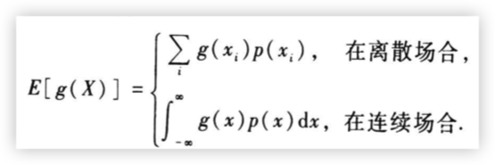
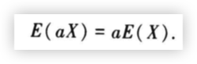
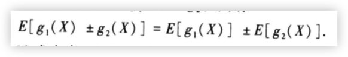
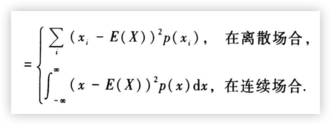

## 期望

RV的函数的期望是函数值和prob的积的积分或导数

$E[c] = c$, c是常数

## 方差

方差的定义：偏差平方的期望

偏差平方：$(X-E[X])^2$

$Var[X] = E[(X-E[X])^2]$

1. 性质1

$Var[X] = E[X^2] - (E[X])^2$

2. 性质2

$Var[c] = 0$

3. 性质3

$Var[aX+b] = a^2Var[X]$

## 协方差

$Cov(X, Y) = E[(X-E[X])(Y-E[Y])] = E[XY] - E[X]E[Y]$

## 相关系数

$Corr(X, Y) = \frac{Cov(X,Y)}{\sqrt{Var(X)}\sqrt{Var(Y)}}$
